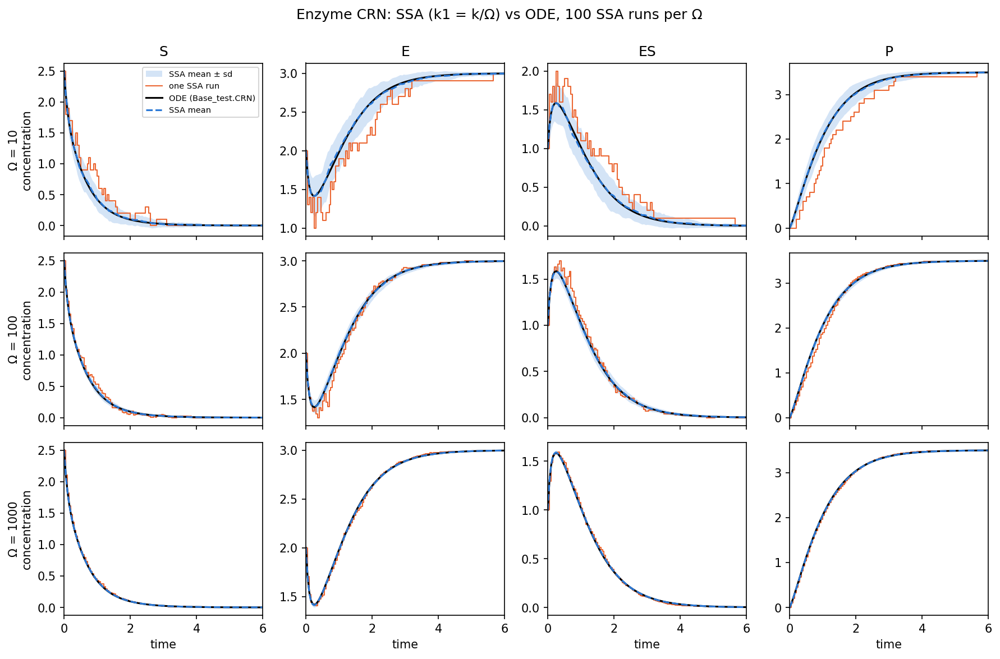
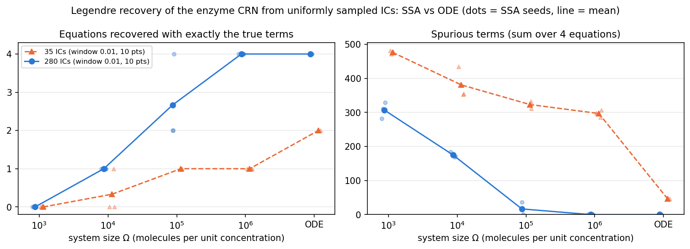

# Stochastic CRN example

Does the good recovery of the enzyme CRN with an orthogonal (Legendre) library and uniformly sampled initial conditions (Figure 2) survive when the data come from stochastic dynamics instead of the ODE?

These scripts reuse the repository code in `Dependence/` unchanged and swap only the simulator: each short trajectory is generated with a Gillespie SSA instead of `Base_test.CRN`.

## Model and parameter mapping

The enzyme CRN in `Base_test.CRN`, with states `x1..x4 = S, E, ES, P`:

| Reaction | Deterministic (concentration) | Stochastic (molecule counts) |
|---|---|---|
| S + E → ES | `k = 2.12456` | `k1 = k / Ω` |
| ES → S + E | `kr = 1.10124` | `k2 = kr` |
| ES → E + P | `kcat = 1.5093` | `k3 = kcat` |

Counts are `Ω × concentration`, where the system size Ω is in molecules per unit concentration. SSA states are divided by Ω before any analysis, so the true model has the same terms and coefficients in both cases:

```
dx1/dt = -k x1 x2 + kr x3
dx2/dt = -k x1 x2 + (kr + kcat) x3
dx3/dt =  k x1 x2 - (kr + kcat) x3
dx4/dt =  kcat x3
```

## Scripts

Run from the repository root in the `illposed` environment (see `environment.yml`).

| Script | What it does |
|---|---|
| `ssa_vs_ode.py` | Checks the mapping: SSA vs ODE trajectories for Ω = 10, 100, 1000 → `results/ssa_vs_ode.png` |
| `stochastic_crn_recovery.py` | The Figure 2 test (uniform ICs, `fit_and_save_base`, `_subsample`, `Recover_Model_sindy` with degree 5, threshold 0.1, after-threshold 1.0, Legendre) run on ODE data and on SSA data from the same ICs; scores each recovered equation against the true model |
| `diagnose_conditioning.py` | Explains the deterministic baseline: finite-difference vs exact derivatives, and library condition number vs number of ICs |
| `plot_recovery.py` | Combines all recovery runs in `output/` → `results/recovery_summary.csv`, `results/recovery_vs_omega.png` |

Reproduce the committed results:

```bash
python Stochastic/ssa_vs_ode.py
python Stochastic/stochastic_crn_recovery.py --num 35  --omegas 1000 10000 100000 1000000 --out Stochastic/output/num35
python Stochastic/stochastic_crn_recovery.py --num 280 --omegas 1000 10000 100000 1000000 --out Stochastic/output/num280
python Stochastic/diagnose_conditioning.py
python Stochastic/plot_recovery.py
```

The 280-IC run takes about 10 minutes, dominated by the Ω = 10⁶ SSA. Runs for different Ω can be split across processes with `--omegas` and separate `--out` folders; `plot_recovery.py` combines everything under `Stochastic/output/`. Trajectory files in `output/` are not committed.

## Findings

**1. The mapping is correct.** The SSA ensemble mean matches the ODE to within 1.6% of each species' range for every Ω tested, and single runs scatter around it as 1/√Ω (single-run RMS error 3–7% at Ω = 10, 0.3–0.7% at Ω = 1000).



**2. With the notebook's settings, the deterministic baseline recovers only 2/4 equations.** dx1 and dx4 are right; dx2 and dx3 pick up about 23 spurious terms each. This matches the output saved in `Figure2/Plots_2.ipynb`, although the figure data in that notebook hard-code 0 wrong equations for Legendre. The cause is ill-conditioning, not the method:

| ICs | cond(degree-5 Legendre library) | Finite-difference derivatives | Exact derivatives |
|---|---|---|---|
| 35 (notebook) | 3.1 × 10⁸ | 2/4, 46 extra terms | 4/4 |
| 70 | 4.4 × 10³ | 4/4 | 4/4 |
| 140 | 1.1 × 10² | 4/4 | 4/4 |
| 280 | 3.6 × 10¹ | 4/4 | 4/4 |

Each IC is integrated for only 0.01 time units, so the 280 data rows form 35 tight clusters. The finite-difference derivatives are accurate to 4 × 10⁻⁵, but a condition number of 3 × 10⁸ amplifies that error into spurious terms. Doubling the number of ICs fixes it.

**3. With a well-conditioned design (280 ICs), stochastic recovery converges to the ODE result; with 35 ICs it does not.**



| Ω | 280 ICs: equations exactly right (3 SSA seeds) | 35 ICs |
|---|---|---|
| 10³ | 0, 0, 0 | 0, 0, 0 |
| 10⁴ | 1, 1, 1 | 0, 1, 0 |
| 10⁵ | 2, 4, 2 | 1, 1, 1 |
| 10⁶ | 4, 4, 4 (coefficients within 0.7%) | 1, 1, 1 |
| ODE | 4 | 2 |

Equations drop out in a consistent order as Ω decreases. dx4 (a single linear term, `kcat x3`) survives down to Ω = 10⁴, then dx1. dx2 and dx3, which have the largest coefficients and normalization scale, fail first.

The limiting factor is derivative noise. The notebook samples each IC 10 times over 0.01 time units, and the finite-difference noise of a jump process scales like √(rate / (Ω Δt)) with Δt ≈ 0.001. Averaging R SSA runs per IC (`--replicates`) is roughly equivalent to increasing Ω by R. Longer windows (`--end`, `--n-step`) trade this noise against finite-difference error and have not been explored yet.

## Notes

- The uniform ICs come from a fixed-seed Sobol sequence (`create_initial_conditions`), so the ODE and SSA runs use identical ICs. The only randomness is the SSA, controlled by `--ssa-seeds`.
- SSA initial counts are `round(Ω × IC)`.
- The SSA is Gillespie's direct method (`ssa_conc` in `stochastic_crn_recovery.py`), with the state recorded at the requested sample times.
